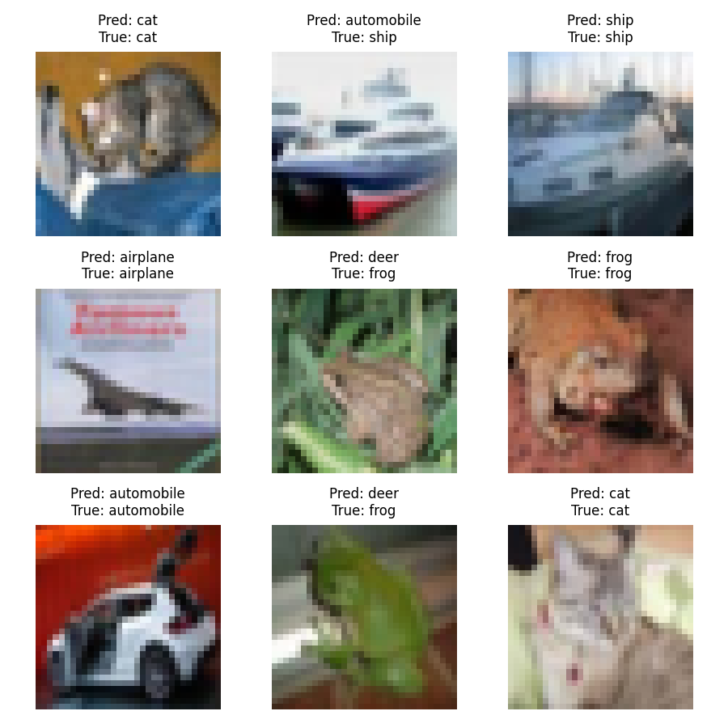

# Project 11 — Image Classification (CNN)

Image classification on CIFAR-10 using a Convolutional Neural Network.

## Model
- 2 Convolutional layers
- MaxPooling
- Fully connected classifier

## Evaluation
Accuracy evaluated on the CIFAR-10 test set.

## Sample Predictions
Below are example predictions from the trained model:

## Key Insight
Even simple CNN architectures can learn meaningful visual patterns from small images.
