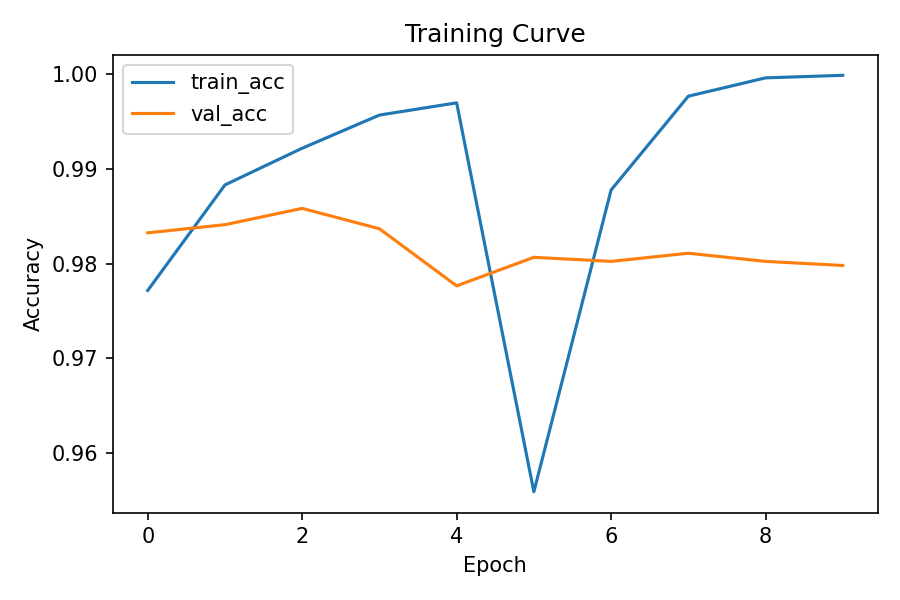

# Project 12 — Cat vs Dog Classifier (Transfer Learning)

Binary image classification using a pretrained CNN.

## Model
- Backbone: MobileNetV2 (ImageNet pretrained)
- Custom classification head

## Training Strategy
1. Freeze backbone and train classifier head
2. Unfreeze top layers and fine-tune with low learning rate

## Training Curve

## Key Insight
Transfer learning enables strong performance with limited data and significantly reduces training time.