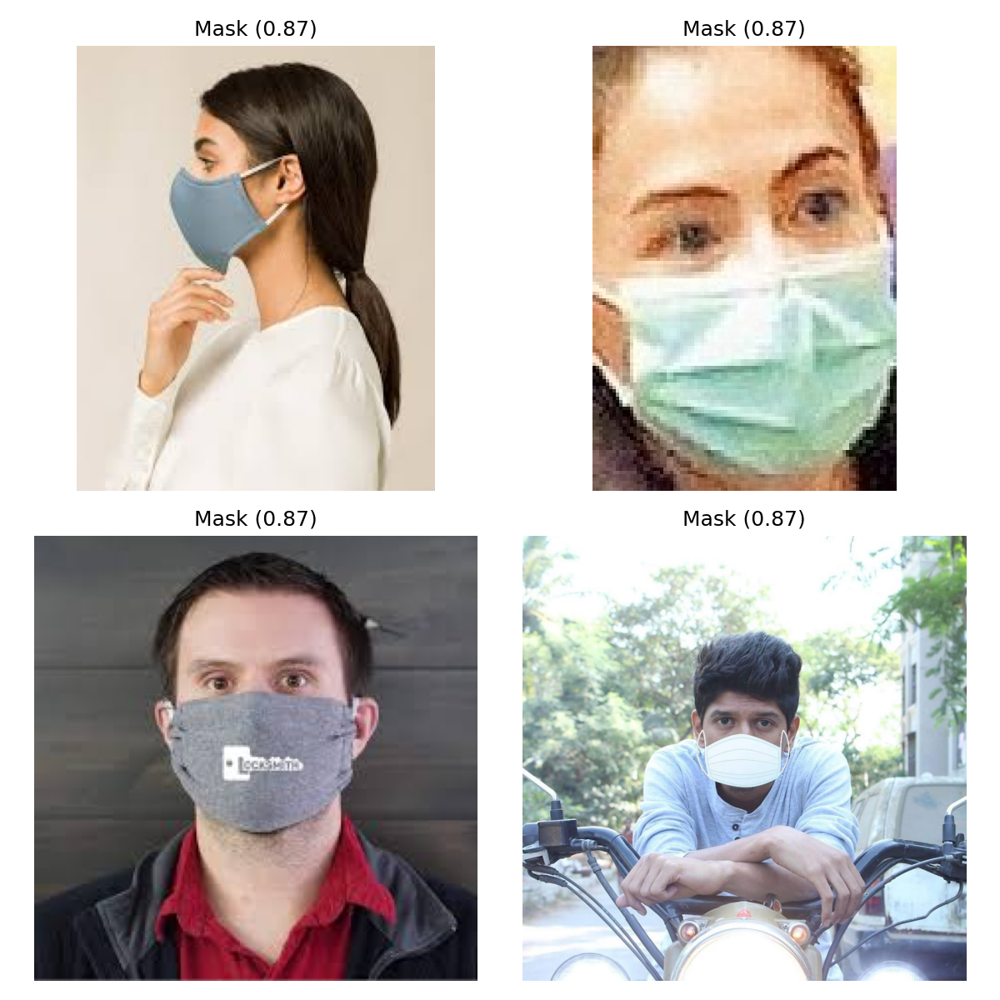

# Project 13 — Face Mask Detection

Binary image classification to detect face masks in real-world images.

## Model
- Pretrained MobileNetV2
- Data augmentation for robustness

## Inference Demo
Below are sample predictions on real images:

## Key Insight
Data augmentation significantly improves robustness for real-world images with varying angles and lighting. 