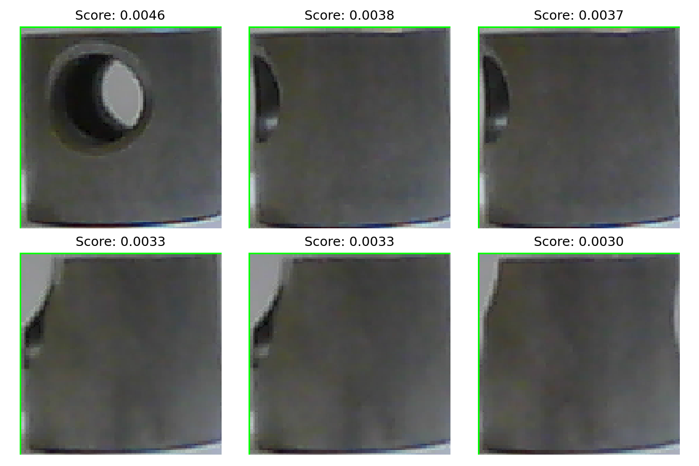

# Project 15 — Defect Detection (Anomaly Detection)

Image anomaly detection using an autoencoder trained on normal samples only.

## Approach
- Train autoencoder on non-defective images
- Use reconstruction error as anomaly score

## Anomaly Score Examples

Normal images show low reconstruction error, while defective samples have higher anomaly scores.

## Key Insight
Anomaly detection works well when defects are rare and hard to label, making it ideal for manufacturing and quality inspection.