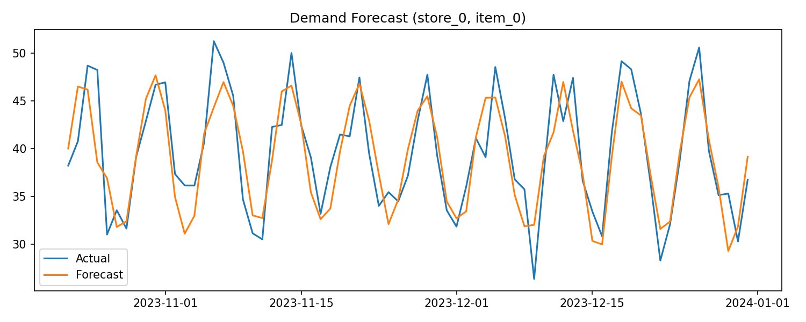

# Project 19 — Demand Forecasting for Inventory

Multi-entity demand forecasting across stores and items using a global model.

## Approach
- Lag features and rolling averages per store-item time series
- One-hot encoding of store_id and item_id
- Time-based train/test split (no shuffling)

## Results
- Overall MAE reported in console
- Hardest store-item pairs saved in `reports/top_errors.csv`

## Top Errors Insight
The highest-error entities likely have:
- higher volatility
- weaker weekly seasonality
- fewer stable historical patterns

## Forecast Plot

## Note

The trained model file is excluded from this repository due to GitHub file size limits but and the missing one can be recreated by rerunning training locally.